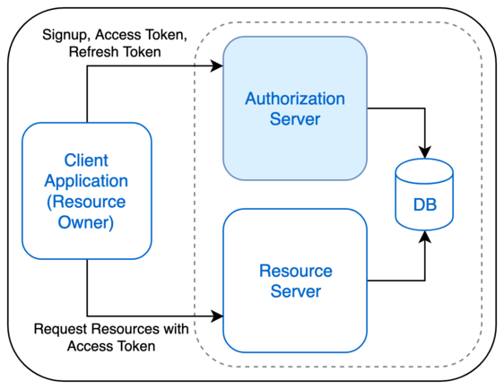

### Standalone Authorization Server

This Authorization Server complies to OAuth2 standards, providing bare minimum sign up and token issuance. Client applications bearing `access token` may request access to Resources. 

### Basic Flow

### Prerequisites

1.Gradle

Gradle is required to manage dependencies and to compile 

### Endpoints 

**Sign Up**

